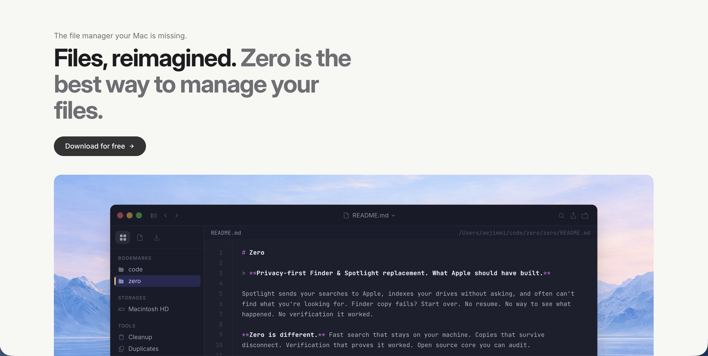

# Zero

The file manager your Mac is missing. Files, search, AI, code intelligence, cloud transfer, sync, cleanup, and automation. Made in Rust. [alpha]




## Your native apps are spying on you

**Spotlight** — you search for a file on your own computer, and that query gets sent to Apple, Microsoft Bing, and unnamed third parties. Along with your location, the apps you use, your interests, and what you click. Enabled by default since 2014.

**Siri** — recordings sent to Apple servers, including accidental activations. A whistleblower revealed contractors listened to intimate conversations, medical details, and business calls. Apple admitted it. Paid $95M to settle the lawsuit in January 2025.

**iCloud** — in February 2025, the UK government secretly ordered Apple to backdoor iCloud under the Investigatory Powers Act. Apple complied by removing end-to-end encryption for all UK users. UK intelligence now has full access to every UK citizen's iCloud data — photos, documents, backups, everything.

Your native apps are broken too. Spotlight can't find your own files. Finder copy fails? Start over — no resume, no verification, no idea if your backup is complete or corrupted. No git status. No cloud transfers. No way to find duplicates. No way to clean up build artifacts eating your disk. No secure erase.


## Install

```bash
curl -sSfL https://zero-coral-tau.vercel.app | bash
```


## Finder, done right

Permissions, owner, git status — visible in every row. Workspaces that remember your bookmarks. Cmd+K to jump to any file or action.

- Split pane — drag between folders without juggling windows.
- Configurable columns, inline rename, multiple selection. 6 native themes.


## Fast search. Smart results.

Searches 1.7 million files in 83 milliseconds. Results ranked by frequency and recency — files you use surface first.

- Filter by type (images, videos, code, documents), extension, language, size, path, or recency.


## Never restart a copy again

Zero resumes from the exact byte — survives sleep, crashes, and disconnects. Every file checksum-verified.

- Mirror, verify, exclude, dry run, permission preservation. Backup templates included.
- Cloud storage: S3, Backblaze B2, Google Cloud Storage, Dropbox, WebDAV.


## Agentic Mode

The agent has your full file index. Ask it to find, move, rename, or clean up — shows every step.

- Claude Sonnet 4.6, Opus 4.6, GPT-5, and more. Bring your own key.
- MCP server — any external AI tool or IDE can query Zero's search and code intelligence.


## More

- **Code intelligence** — search for a function and get its definition, not every file that mentions it. Structural search across every project on your machine.
- **Git integration** — modified, staged, untracked visible in the file browser. Folders show change counts.
- **Text editor** — built-in editor with syntax highlighting for 28 languages.
- **Data tables** — open a CSV and see a real table. Sortable columns, auto-detected delimiters.
- **Cleanup** — node_modules, build caches, system logs, old downloads — 36 categories. Shows size before you touch anything. Reversible with Put Back.
- **Deduplication** — scans folders and drives for identical files. Batch deletion with verification.
- **Automation** — auto-sync when a USB drive connects or source files change. Daemon mode.
- **Disk** — volumes, capacity, filesystem details. Secure erase with multiple strength levels.


## Performance

| Operation | Speed |
|-----------|-------|
| Search 1.7M files | 83ms |
| Type filter (images) | 0.04ms |
| Recent files query | 0.19ms |
| Sync (local SSD) | 874 MB/s |
| Sync + verify | 653 MB/s |
| Resume vs rsync | 3x faster |


## Coming Soon

- Encrypted search index
- P2P file sharing — zero-knowledge, no server middleman
- Automations UI
- Cleanup profiles — community-maintained rules for OS artifacts, dev environments, app traces
- Cross-platform (Linux, Windows)


## Documentation

- [FEATURES.md](FEATURES.md) — Complete feature list
- [COMMANDS.md](COMMANDS.md) — Full CLI reference


## License

MIT / Apache-2.0

---

Built by [Jimmi Andersen](https://github.com/aejimmi) — building [Tell](https://tell.rs). Founded Logpoint (acquired).
